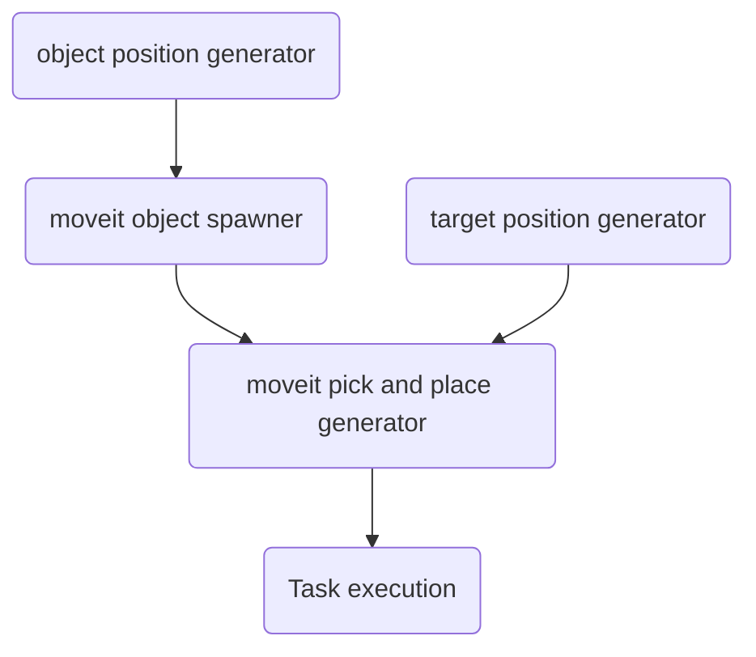

# corosect

- [corosect](#corosect)
  - [Commands to run the program](#commands-to-run-the-program)
  - [Make gazebo display movements planned in moveit](#make-gazebo-display-movements-planned-in-moveit)
  - [To make a python script that can be used using rosrun:](#to-make-a-python-script-that-can-be-used-using-rosrun)
  - [To make the zed camera work with ros](#to-make-the-zed-camera-work-with-ros)
  - [To connect the realsense d435 to the program.](#to-connect-the-realsense-d435-to-the-program)
  - [If moveit gives problems with the display of the pointcloud because it is looking too far into the future](#if-moveit-gives-problems-with-the-display-of-the-pointcloud-because-it-is-looking-too-far-into-the-future)
  - [How to make ros display an octomap](#how-to-make-ros-display-an-octomap)
  - [Make the moveit task constructor work](#make-the-moveit-task-constructor-work)
  - [If the robot does not load in to the correct position](#if-the-robot-does-not-load-in-to-the-correct-position)
  - [Programming the moveit task constructor](#programming-the-moveit-task-constructor)
  - [pick and place pipeline](#pick-and-place-pipeline)
  - [missing stl](#missing-stl)
  - [references](#references)


---

This entire readme assumes the usage of ROS Noetic and Ubuntu 20.04. The most recent versions as of February 2023 was used.

## Commands to run the program
```
roslaunch iiwa_moveit_config custom_launch_file.launch use_rviz:=true use_zed:=false use_realsense:=false
```
The use_zed and use_realsense are the parameters that control whether or not the cameras are used. They are true by default and are thus not needed if you want to use the cameras. The use_rviz is false by default.

---

## Make gazebo display movements planned in moveit
Things that have been changed to make MoveIt work with Gazebo using the demo_gazebo.launch file:

1. Made sure that all controllers and gazebo-ros-control packages were installed.
2. While generating the MoveIt config with the setup assistant the planning groups were named with a / at the start (e.g. /arm) Although I am not sure whether this is a necessary step.
3. In the ros_controller.launch file replaced this:
```
<node name="controller_spawner" pkg="controller_manager" type="spawner" respawn="false"
    output="screen" args="arm_controller gripper_controller"/>
```
With this:
```
<node name="controller_spawner" pkg="controller_manager" type="spawner" respawn="false"
    output="screen" args="--namespace= 
    /arm_controller 
    /gripper_controller 
    --timeout 20"/>
```
4. MAKE SURE THAT IN YOUR URDF IN THE LOCATION THAT THE GAZEBO CONTROL PLUGIN IS ADDED THAT THIS LINE IS COMMENTED, THIS IS BECAUSE THIS CAUSES THE ENTIRE CONTROLLER SYSTEM TO NOT WORK:
```
<robotNamespace>/iiwa</robotNamespace>
```
5. Now while running the demo_gazebo.launch file with roslaunch, the simulation should work.


---


## To make a python script that can be used using rosrun:

1. Create it inside a ROS package
2. Add shebang to first line of script. i.e.: #!/usr/bin/env python3
3. Make the file executable with: chmod +x <your python script path>
4. Rebuild catkin workspace (might not be mandatory)
5. It should now be executable with rosrun


---
	
## To make the zed camera work with ros

1. install the zed ros wrapper which can be found [on the official github repository](https://github.com/stereolabs/zed-ros-wrapper) or as described [on a clone of it in this repository](/zed-ros-wrapper/README.md)
2. Since (atleast in the case of this project) the camera's tf is already handled by moveit you need to make a change in the launch file of the camera. In our case it was in the [zed2i.launch](/zed-ros-wrapper/zed_wrapper/launch/zed2i.launch) We replaced in line 39:
```<include file="$(find zed_wrapper)/launch/include/zed_camera.launch.xml">```
with ```<include file="$(find zed_wrapper)/launch/include/zed_no_tf.launch.xml">``` and we made sure to put publish_urdf to false when launching this file.
3. To add it to our main launch file we included it by adding this to it:
```
<include file="$(find zed_wrapper)/launch/zed2i.launch">
    <arg name="camera_name" value="zed2i"/>
    <arg name="camera_model" value="zed2i"/>
    <arg name="publish_urdf" value="false"/>
  </include>
  ```
4. Now it should be working fine by launching the program. All the Zed camera's topics should be launched 
5. Make the camera use neural networks for depth quality: change in zed_wrapper/params/common.yaml the depth quality from 1 to 4

---

## To connect the realsense d435 to the program.

1. install the rospackage for realsense (it can be found [here](https://github.com/IntelRealSense/realsense-ros/tree/ros1-legacy))
2. To make the the camera work with this package we slightly modified one of the launch files provided with it. I am not 100% sure what I exactly changed because I didn't exactly document it back then but it works.

---

## If moveit gives problems with the display of the pointcloud because it is looking too far into the future
To solve this problem we implemented a [small script](/iiwa_moveit_config/scripts/point_cloud_time_sync.py) that listens to a provided topic (this can be easily modified in the script) and then updates the timestamp of the pointcloud to the current time this may make it look like the pointcloud is newer than it actually is but the delay is on a negligible scale. This script only assumes that the message is of type pointcloud2 for the rest it should always work.

---

## How to make ros display an octomap

1. In the [sensor_manager.launch.xml](iiwa_moveit_config/launch/sensor_manager.launch.xml) file generated by the moveit setup assistant a few modifications need to be made to make it work. The linked files has the updated version.
2. The yaml file loaded in the sensor_manager.launch.xml needs to be created in the config directory. In our case I created the [sensor_kinect_pointcloud.yaml](iiwa_moveit_config/config/sensors_kinect_pointcloud.yaml) although the naming should maybe be changed from kinect to Zed/Realsense to indicated which camera is actually being used. This yaml file describes the details of the pointcloud that is being analysed. To make it work I had to make it listen to the custom pointcloud topic which is the one that is made in [this section](#if-moveit-gives-problems-with-the-display-of-the-pointcloud-because-it-is-looking-too-far-into-the-future) 
3. There might also have been a small change in the [move_group.launch](/iiwa_moveit_config/launch/move_group.launch) in sensor functionality part (line 79-81) but not sure. If it is not yet working it might be worth looking at.
4. The octomap should now be visualised in rviz.

---

## Make the moveit task constructor work
1. I reinstalled moveit using the binary form instead of from source which seemed to make a different although I am not sure. It wasn't recognizing the moveit.task_constructor module at first but then when I ran it again after redoing it did some kinda uncertain.
2. another thing I changed was that I installed the python-is-python3 module. with ```sudo apt install python-is-python3``` So that could have had an effect
3. To make it work with the custom launch file I replaced the rviz_config in line 43 of [custom_launch_file.launch](iiwa_moveit_config/launch/custom_launch_file.launch) from ```$(dirname)/moveit.rviz``` to ```$(dirname)/mtc.rviz``` this will launch rviz with the specified rviz configuration which enables task construction. This new rviz file was made using the one in the task_constructor package as base and modifying the name of the fixed frame and target frame to the one applicable for the robot arm 
4. One thing that caused a problem was the $(find iiwa_moveit_config) that was used find the new rviz file I have no explanation for it but it managed to work by moving the [mtc.rviz](iiwa_moveit_config/launch/mtc.rviz) to the launch folder. There is no explanation for it but it works like this.

---

## If the robot does not load in to the correct position
1. sometimes all you need to do is restart. I've had cases where I had 2/3 starts not load correctly and then then it did. Nothing was changed in the code.

---

## Programming the moveit task constructor
1. There is a documentation of the entire api which is a bit hard to find but it is available [here](https://ros-planning.github.io/moveit_task_constructor/index.html) 
2. There is a small condition to using the task constructor and that is to reference this paper:
```
@inproceedings{goerner2019mtc,
  title={{MoveIt! Task Constructor for Task-Level Motion Planning}},
  author={Görner, Michael* and Haschke, Robert* and Ritter, Helge and Zhang, Jianwei},
  booktitle={IEEE International Conference on Robotics and Automation (ICRA)},
  year={2019}
}
```
3. The moveit task constructor does not come with base moveit and needs to be installed from source as explained in [Make the moveit task constructor work](#make-the-moveit-task-constructor-work).
4. If you want to use the task constructor in python you'll need to import the following files:
```py
from moveit.task_constructor import core, stages
from moveit.python_tools import roscpp_init
```
  vscode or any other IDE may say that the package does not exist but as long as you have the moveit task constructor in the same catkin workspace then it should run.

5. Next you need to initialize a roscpp node using a line like ```roscpp_init("mtc")``` the mtc is the name of the node that is being started.
6. afterwards the tutorials mentioned in point 1 are all that is needed to get it working.
7. To get the grasp generator to work make sure that in the moveit  setup config you specify the end effector parent group otherwise you'll run into an error similar to this: 
```
Group '' not found in model
```
8. Another problem that may occure is that the grasping part works but the connector stage to the grasping position finds no results. This may be due to the fact that no planner for one of the planning groups is used in the connector. In my case I did not add the gripper group to the list of planners for the connector which made it unable to find a move to a position where the gripper was open. To implement this you just need to make it like this:

```py
pipeline = core.PipelinePlanner()
pipeline.planner = "RRTConnectkConfigDefault"
planners = [("/arm", pipeline),("/gripper",pipeline)]
task.add(stages.Connect("move to pick", planners))
```
In this code the /arm and /gripper are the 2 move groups defined in the moveit setup assistant.
9. If you want to change the angle at which the object is picked up modify the poseStamped that is used for the input of the Ik frame. In our code this would be something like this:
```py
simpleGrasp = stages.SimpleGrasp(grasp_generator, "Grasp")
# Set frame for IK calculation in the center between the fingers
ik_frame = PoseStamped()
ik_frame.header.frame_id = "rg6_link_0"
ik_frame.pose.position.z = 0.1934
ik_frame.pose.orientation.x = 0.5
ik_frame.pose.orientation.y = 0.5
ik_frame.pose.orientation.z = 0.5
ik_frame.pose.orientation.w = 0.5
simpleGrasp.setIKFrame(ik_frame)
```

---

## pick and place pipeline



---

## missing stl
The stl for the support structure was not include in the git because it was too big and was not worth pushing to git

---

## references
Michael Görner*, Robert Haschke*, Helge Ritter, and Jianwei Zhang,
"MoveIt! Task Constructor for Task-Level Motion Planning",
_International Conference on Robotics and Automation (ICRA)_, 2019, Montreal, Canada.
[[DOI]](https://doi.org/10.1109/ICRA.2019.8793898) [[PDF]](https://pub.uni-bielefeld.de/download/2918864/2933599/paper.pdf).

```
@inproceedings{goerner2019mtc,
  title={{MoveIt! Task Constructor for Task-Level Motion Planning}},
  author={Görner, Michael* and Haschke, Robert* and Ritter, Helge and Zhang, Jianwei},
  booktitle={IEEE International Conference on Robotics and Automation (ICRA)},
  year={2019}
}
```